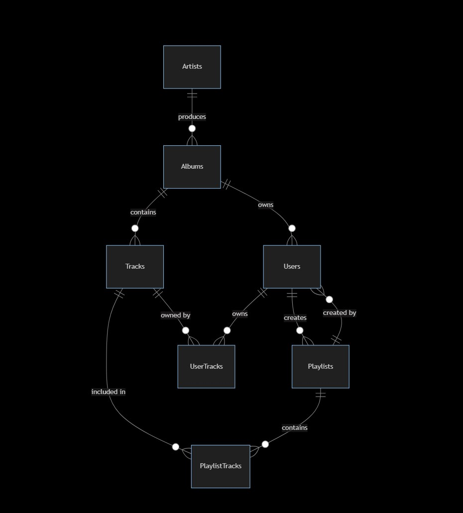

# Design Document

By Audrius Juknevicius

Video overview: <https://youtu.be/dHArP1a99hs>

## Scope

* **What is the purpose of your database?**

The purpose of the database is to function as a central repository for managing and organising music and user-related data.
It enables users to explore music in different ways such as genre or artist-specific albums. Tracks can be obtained, played and added to individual playlists.

There is also functionality to engage with other users and view albums, songs and artists in various lists such as top music or favourite artist by most played album or track. In addition, you have user tracking and management.

* **Which people, places, things, etc. are you including in the scope of your database?**

_Users:_
> Create user-specific account with basic information such as name and
> ability to add a profile picture.

_User tracks:_
> Ability to add tracks, favourite them and count the number of times a
> specific track has been played.

_Tracks:_
> Singular-tracks that are derived from albums. Fields include title,
> duration and lyrics.

_Playlists:_
> User created playlists with specific tracks to suit their music preference.
> Includes time created, description, an image if desired, last updated and
> an option to make it public.

_Playlist-tracks:_
> A sub-table that contains all of the tracks that are added into playlists.
> As a bonus includes track order which could be utilized to shuffle music.

_Artists:_
> Table with the name of the artist, their picture and a biography field
> if desired.

_Albums:_
> Includes the album title, release date, genre, album cover and description.

* **Which people, places, things, etc. are *outside* the scope of your database?**

_Music Labels:_
> Currently, the database does not have or show any connection between artists
> and their labels.

_Financial Transactions:_
> A music database typically focuses on managing information related to music
> and does not handle transactions. Hence, there is no transaction log or
> information regarding purchases, subscriptions or any types of payments.

## Functional Requirements

* **What should a user be able to do with your database?**

A user should be able to:
> 1. Register and manage their account, update their profile information and
> login information.
> 2. Discover and search for music through different means such as artist,
> genre, track name or another user's playlist name.
> 3. Create personalised playlists, and make them public or private.
> 4. Listen to music, interact with different songs and shuffle playlists.
> 5. View information on artists and albums such as biography and album cover
> or artist picture.
> 6. Obtain tracks which can then be listened to and used in creating a playlist.

* **What's beyond the scope of what a user should be able to do with your database?**

Additional functionality beyond the scope:
> 1. Add or delete information and data beyond their personal profile.
> E.g. adding an artist.
> 2. Be able to see private playlists or manage playlists that do not belong to
> them.
> 3. Change and update other user profiles besides their own.

## Representation

Entities are captured in MySQL tables with the following schema. (`schema.sql`)

### Entities
* **Which entities will you choose to represent in your database?**
* **What attributes will those entities have?**
* **Why did you choose the types you did?**
* **Why did you choose the constraints you did?**

#### 1. "users"

`id` - A unique numeric identifier for the user
> - The datatype is `INT(Integer)`, which is used to store numbers.
> - For it to be a unique numeric ID, `AUTO_INCREMENT` is applied which
> allows a unique number to be generated automatically when a new record enters
> the table.
> - It is also a primary key for this entity.

`first_name` - First name of the user
> - As the datatype is expected to be alphanumeric, the `VARCHAR` datatype with
> a limit of 32 characters is used.
> - This field has a `NOT NULL` constraint, meaning it cannot be empty.

`last_name` - Last name of the user
> - As the datatype is expected to be alphanumeric, the `VARCHAR` datatype with
> a limit of 32 characters is used.
> - This field has a `NOT NULL` constraint, meaning it cannot be empty.

`username` - Username of the user
> - As the datatype is expected to be alphanumeric, the `VARCHAR` datatype with
> a limit of 32 characters is used. This field is used to login.
> - This field has a `NOT NULL` constraint, meaning it cannot be empty.
> - This field has a `UNIQUE` constraint, so no two accounts can be mixed up
> during login phase - this is checked during registration.

`display_name` - Name of the profile/account
> - This can be viewed by other users.
> - The datatype is expected to be alphanumeric, the `VARCHAR` datatype with a
> limit of 32 characters is used.
> - This field has a `NOT NULL` constraint, meaning it cannot be empty.

`email` - Email address that the user registered with
> - The datatype is expected to be alphanumeric, including special characters
> so a `VARCHAR` datatype with a limit of 64 characters is used. The limit is
> increased as email addresses can be longer than 32 characters.
> - This field has a `NOT NULL` constraint, meaning it cannot be empty.
> - This field has a `UNIQUE` constraint, so only one email address can be
> associated to one account and no two accounts can have the exact same one.
> The email is used to contact the person and also authorise changes to the
> profile/account.

`password` - Password used to login with username and or email
> - The datatype is expected to be alphanumeric, including special characters
> so a `VARCHAR` datatype with a limit of 32 characters is used.
> - This field has a `NOT NULL` constraint, meaning it cannot be empty.
> Leaving the password blank would mean anyone could access your account!

`registration_date` - Date and time the user account was registered
> - The datatype is date and time therefore `DATETIME` is used.
> - This field has a `CURRENT_TIMESTAMP` constraint, meaning that by default,
> it will populate the field with the current date and time upon registration.

`date_of_birth` - Date of birth that the user can optionally fill out.
> - The datatype is `DATE` as days, months and years are expected to be in this
> field.
> - As the field is optional, no constraints are applied.

`profile_image` - Optional field which is used to show an image of choice
selected by the user.
> - The datatype is `MEDIUMBLOB` to hold up to 16,777,215 bytes of data (16.7 Megabytes).
> This will be populated by an image.

#### 2. user_tracks"

`user_id` - A unique numeric identifier for the user
> - The datatype `INT` was used, as the field is expected to be a numerical
> value.
> - This is a primary key for this entity, alongside another attribute,
> making a "composite primary key".
> - This is also a foreign key for this entity from _"Users"_.

`track_id` - A unique numeric identifier for the track
> - The datatype `INT` was used, as the field is expected to be a numerical value.
> - This is a primary key for this entity, alongside another attribute, making
> it a "composite primary key".
> - This is also a foreign key for this entity from _"tracks"_.

`date_added` - The date that the track was obtained by the user
> - The datatype is date and time therefore `DATETIME` is used
> - This field has a `CURRENT_TIMESTAMP` constraint, meaning that by default it
> will populate the field with the current date and time upon obtaining the track.

`is_favourite` - If a track is favourited by the user or not
> - The datatype `INT` was used, as the field is expected to be a numerical
> value.
> - This field has a `DEFAULT` constraint. Unless no other value is specified,
> a default value will show which is 0 in this case. If a song gets favourited,
> the value will be 1.

`play_count` - How many times a specific track was played by the user
> - The datatype `INT` was used, as the field is expected to be a numerical
> value.
> - This field has a `DEFAULT` constraint. Unless no other value is specified,
> a default value will show which is 0 in this case.

`track_title` - The name of the track
> - The datatype `TEXT` was used as this is expected to be a string of
> characters.
> - This field has a `NOT NULL` constraint, meaning it cannot be empty.
> - This field is also a foreign key from _"tracks"_.

#### 3. "tracks"

`id` - A unique numeric identifier associated with the track
> - The datatype `INT` was used, as the field is expected to be a numerical
> value.
> - This field has a `AUTO_INCREMENT` which allows a unique number to be
> generated automatically when a new record enters the table.
> - This field is a primary key.

`artist_id` - A unique numeric identifier associated with the artist
> - The datatype `INT` was used, as the field is expected to be a numerical
> value.
> - This field is a foreign key from _"artists"_.

`artist_name` - The name of the artist
> - The datatype is expected to be alphanumeric, including special characters,
> so a `VARCHAR` datatype with a limit of 32 characters is used.
> - This field is a foreign key from _"artists"_.

`title` - The name of the track
> - The datatype used is `VARCHAR`, as it is expected to be alphanumeric,
> including special characters. A limit of 32 characters is used.
> - This field has a `NOT NULL` constraint, meaning it cannot be empty.

`duration` - The duration of the specific track
> - The datatype `INT` was used, as the field is expected to be a numerical
> value.

`album_id` - A unique numeric identifier associated with the album
> - The datatype `INT` was used, as the field is expected to be a numerical
> value.
> - This field has a `AUTO_INCREMENT` which allows a unique number to be
> generated automatically when a new record enters the table.
> - This field is a foreign key from _"albums"_.

`lyrics` - The lyrics of a track so a user can sing along
> - The datatype `TEXT` was used as this is expected to be a string of
> characters.
> - No constraints were used on this one as it is not necessary for the track
> to contain lyrics.

`release_date` - The date at which the track was released
> - The datatype used was `DATE` as date and time is the expected value.

#### 4. "playlists"
`playlist_id` - A unique numeric identifier associated with the playlist
> - The datatype `INT` was used, as the field is expected to be a numerical
> value.
> - This field has a `AUTO_INCREMENT` which allows a unique number to be
> generated automatically when a new record enters the table.
> - This field is a primary key.

`playlist_name` - The user selected name for the playlist
> - The datatype used is `VARCHAR`, it is expected to be alphanumeric,
> including special characters. A limit of 32 characters is used.
> - This field has a `NOT NULL` constraint, meaning it cannot be empty.

`playlist_image` - An optional user chosen image
> - The datatype is `MEDIUMBLOB` to hold up to 16,777,215 bytes of data
> (16.7 Megabytes).
> - This can be populated by an image.

`user_id` - The unique numberic identifier associated with a user's account
> - The datatype `INT` was used, as the field is expected to be a numerical
> value.
> - This is a foreign key from _"users"_.

`playlist_description` - An optional user-inputted description of the playlist
> - The datatype `TEXT` was used as this is expected to be a string of
> characters.

`created_at` - The date and time the playlist was created
> - The datatype is date and time therefore `DATETIME` is used.
> - This field has a `DEFAULT` constraint. Unless no other value is specified,
> a default value will show which is `CURRENT_TIMESTAMP` in this instance.

`last_updated` - The date and time the playlist was last updated or edited
> - The datatype is date and time therefore `DATETIME` is used.
> - This field has a `DEFAULT` constraint. Unless no other value is specified,
> a default value will show which is `CURRENT_TIMESTAMP` in this instance.

`public_or_private` - Whether the playlist is private or public so other users
can view and play it.
> - The datatype is `ENUM`, meaning this field can only be one of the
> predetermined values which in this case is `"public"` or `"private"`.
> - This field has a `NOT NULL` constraint, meaning it cannot be empty.
> - This field has a `DEFAULT` constraint. Unless no other value is specified,
> a default value will show which in this case is `"public"`.

#### 5. "playlist_tracks"

`playlist_id` - A unique numeric identifier associated with the playlist
> - The datatype `INT` was used, as the field is expected to be a numerical
> value.
> - This field is part of a composite primary key.
> - This field is also a foreign key from _"playlists"_.

`track_id` - A unique numberic identifier associated with the track
> - The datatype `INT` was used, as the field is expected to be a numerical
> value.
> - This field is part of a composite primary key.
> - This field is also a foreign key from _"tracks"_.

`track_order` - The order of which tracks appear, depending on when they were
added.
> - The datatype `INT` was used, as the field is expected to be a numerical
> value.

#### 6. "artists"

`artist_id` - A unique numeric identifier associated with the artist
> - The datatype `INT` was used, as the field is expected to be a numerical
> value.
> - This field has a `AUTO_INCREMENT` which allows a unique number to be
> generated automatically when a new record enters the table.
> - This field is a primary key.

`artist_name` - The name of the artist
> - The datatype used is `VARCHAR`, it is expected to be alphanumeric,
> - including special characters. A limit of 32 characters is used.
> - This field has a `NOT NULL` constraint, meaning it has to contain a value.

`artist_picture` - An optional artist chosen image
> - The datatype is `MEDIUMBLOB` to hold up to 16,777,215 bytes of data
> (16.7 Megabytes).
> - This can be populated by an image.

`biography` - An optional description of the artist
> - The datatype `TEXT` was used as this is expected to be a string of
> characters.

#### 7. "albums"

`album_id`
-Specifies a unique number associated with the album.
-The datatype `INT` was used, as the field is expected to be a numerical value.
-This field has a `AUTO_INCREMENT` which allows a unique number to be generated automatically when a new record enters the table.
-This field is a primary key.

`album_title`
-Specifies the title of the album which users can utilize in their search.
-The datatype used is `VARCHAR`, it is expected that letters, numbers and symbols will be used. A limit of 32 characters is used.
-This field has a `NOT NULL` constraint, meaning it has to contain a value.

`release_date`
-Shows the date at which the album was released.
-The datatype is `DATE` as the field is expected to be days, months and years.

`album_cover`
-Shows an imagine to represent the album.
-The datatype is `MEDIUMBLOB` to hold up to 16,777,215 bytes of data. (16.7 Megabytes)
This will be populated by an image.

`album_genre`
-Specifies which genre the album belongs to for example rock or pop.

`artist_id`
-Specifies a unique number associated with the artist.
-The datatype `INT` was used, as the field is expected to be a numerical value.
-This field has a `AUTO_INCREMENT` which allows a unique number to be generated automatically when a new record enters the table.
-This field is a foreign key.

`album_description`
-Specifies a description of the album, an optional field.
-The datatype `TEXT` was used as this is expected to be a string of characters.

### Relationships

#### 1. Users
> - Each user can own multiple user tracks and create multiple playlists.

Both of these are one-to-many relationships.

#### 2. User Tracks
> - Each user track belongs to one user.

Many-to-one relationship.

#### 3. Tracks
> - Each track can be included in multiple user tracks.

One-to-many relationship.

> - Each track belongs to one album.
> - Each track belongs to one artist.

Both of these are many-to-one relationships.

> - Each track can be included in multiple playlists.

Many-to-many relationship.

#### 4. Playlists
> - Each playlist belongs to one user.

Many-to-one relationship.

> - Each playlist can contain multiple tracks.

Many-to-many relationship.

#### 5. Playlist Tracks
> - Each playlist track corresponds to one playlist.
> - Each playlist track corresponds to one track.

Both are many-to-one relationships.

#### 6. Artists:
> - Each artist can produce multiple albums.
> - Each artist's name is associated with multiple tracks.

Both are one-to-many relationships.

#### 7. Albums:
> - Each album belongs to one artist.

Many-to-one relationship.

> - Each album can contain multiple tracks.

One-to-many relationship.

## Optimizations

* **Which optimizations (e.g., indexes, views) did you create? Why?**

### Indexes
There are 4 indexes in total.
> In a normal music database such as Hearify, the majority of users will be
> searching for tracks by track titles, artist names or album names.
> Therefore all three of those have been indexed.
>
> Lastly, nobody wants to wait long before they can login, therefore username
> index was also created. This allows everyone to login as quickly as possible
> which also alleviates pressure from the server running more queries.
>
> In a way, the quicker a user can be logged in, the quicker the query can be
> accomplished, freeing up valuable server capacity to execute other commands
> and queries.

### Views
There is one view to look at the top 10 tracks.
> This is similar to popular top 40 songs and other various leaderboards by
> which some users tend to listen to various tracks. It could easily be
> duplicated and edited to include many similar views including artists and
> which is the newest most listened to album.

### Additional Optimisation
`"playlist_tracks"`
> A sub-table to store the tracks contained in the playlist and should optimise
> the server performance.

## Limitations

* **What are the limitations of your design?**

### 1. Limited Data Integrity
> While the schema is functional with foreign keys between the tables, it lacks
> further constraints such as checks or triggers to make sure more complex
> rule sets are followed resulting in a much higher data integrity.

### 2. Limited Flexibility
> The current schema lacks flexibility and more customisation. There is no way
> for users to communicate between one another, and currently there is no way
> to favourite a playlist from another user.
>
> In addition, there is no table for favourite tracks or playlists which could be made.

### 3. Complexity and Growth
> I attempted to limit the number of tables within the database to allow for
> efficient data optimisation. However, reflecting upon the end result, I
> believe that spreading the data across additional tables would have been a
> better solution.
>
> Currently, each table has many attributes, which could result in a decrease in
> server performance if too many queries are carried out in a short amount of
> time.
>
> This could present a real challenge to the growth of Hearify.

### 4. Security
> Storing the password as a string in the _"users"_ table is not secure and
> could easily be exploited. It should be hashed and secured safely with
> additional triggers implemented to prevent a data breach.

* **What might your database not be able to represent very well?**

### 1. Additional Metrics
> The schema does not include tables or triggers to capture additional
> information which could help with trend analysis or other streaming
> analytics that could be used to present more personalised track offers to
> users, such as geographical data.

### 2. Dynamics
> Due to the one-to-many relationship between artists and albums, it is
> currently impossible to represent a track or album that has multiple
> contributors or collaborators.

### 3. Transactions
> As previously mentioned, the current schema does not support an integrated
> system for transactions or purchasing. This is typically done by another
> database or external management system, however it could be possible to use
> a trigger to store simple metadata about transactions within the database such as purchase
> date, price, country, region etc.
